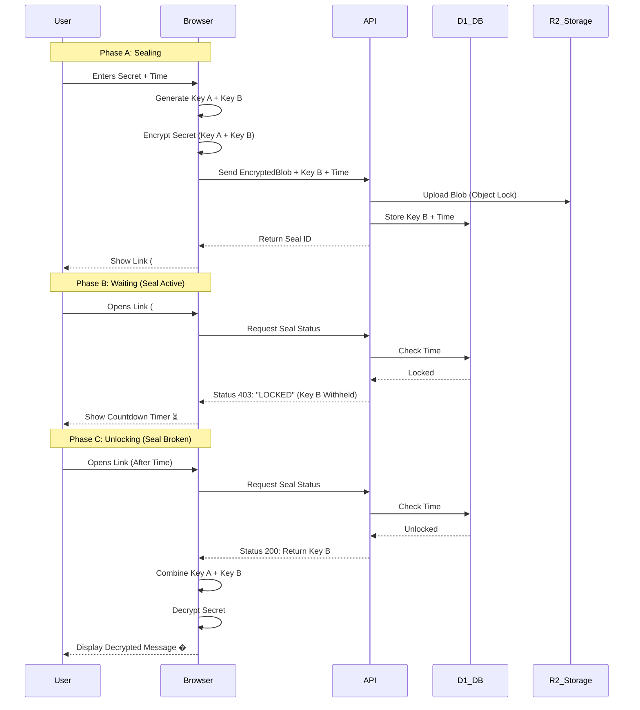

<div align="center">


# ⏳ TIME-SEAL
### The Unbreakable Protocol


### *"If I go silent, this speaks for me."*

[Create a Seal](http://localhost:3000) · [View Architecture](#-architecture) · [Report Bug](https://github.com/teycir/timeseal/issues)

</div>

---

## ⚡ Overview

**TIME-SEAL** is a cryptographically enforced time-locked vault system built on Cloudflare's edge infrastructure. It allows you to encrypt a file or message that **mathematically cannot be opened** until a specific moment in the future.


### Why is this different?
> most "future message" apps contain "trust me bro" promises. Time-Seal is **Cryptographically Enforced** at the Edge.

---

## 🏗️ Architecture

<div align="center">
  <h3>Zero-Trust • Edge-Native • Unbreakable</h3>
</div>

### 🔒 Layer 1: The Vault (R2 Object Lock)
> **Immutable Storage**
Files are stored in Cloudflare R2 with **WORM Compliance** (Write Once, Read Many). This prevents deletion—even by the admin—until the unlock time expires.

### 🤝 Layer 2: The Handshake (Split-Key Crypto)
> **Trust-Minimized**
We use a Split-Key architecture to ensure no single party can decrypt the data early.
*   **Key A (User):** Stored in the URL hash. Never sent to the server.
*   **Key B (Server):** Stored in D1 database inside the secure enclave.
*   **The Check:** The server refuses to release Key B until `Now > Unlock_Time`.

### 💓 Layer 3: The Pulse (Dead Man's Switch)
> **Automated Release**
If used as a Dead Man's Switch, the user must click a private "Pulse Link" periodically. If they fail to check in, the seal unlocks automatically for the recipient.

---

## 🧠 Logic Flow



---

## 🎯 Use Cases

### 💀 The Crypto Holder
**Scenario:** "I have my seed phrase in a Time-Seal. If I die, it unlocks for my wife after 30 days of silence. If I'm alive, I reset the timer."

**How it works:**
1. Create a Dead Man's Switch seal with your seed phrase
2. Set pulse interval to 30 days
3. Share the public vault link with your wife
4. Keep the private pulse link secret
5. Click the pulse link every 30 days to keep it locked
6. If you die/disappear, the seal auto-unlocks for your wife

### 🕵️ The Whistleblower
**Scenario:** "I have evidence. If I am arrested and can't click the reset button, the evidence goes public automatically."

**How it works:**
1. Upload sensitive documents to a Dead Man's Switch seal
2. Set pulse interval to 7 days
3. Share the public vault link with journalists/activists
4. Pulse every week to keep evidence locked
5. If arrested/silenced, evidence automatically releases
6. Creates accountability and protection

### 🚀 The Marketer
**Scenario:** "I'm dropping a limited edition product. The link is public now, but nobody can buy until the timer hits zero."

**How it works:**
1. Create timed release seal with product details/access codes
2. Set exact launch date and time
3. Share vault link publicly on social media
4. Build anticipation with countdown timer
5. Product automatically unlocks at launch time
6. Creates viral marketing buzz

### 🎁 The Gift Giver
**Scenario:** "I want to send a birthday message that unlocks exactly at midnight on their birthday."

**How it works:**
1. Write personal message or upload video
2. Set unlock time to birthday midnight
3. Send vault link in advance
4. Recipient sees countdown until birthday
5. Message unlocks at perfect moment
6. Creates magical surprise experience

### 🏛️ The Legal Professional
**Scenario:** "I need to ensure this contract becomes active only after the settlement date."

**How it works:**
1. Seal legal documents with specific unlock date
2. Share vault link with all parties
3. Documents remain cryptographically locked
4. Auto-unlock when settlement period expires
5. Ensures compliance and timing
6. Provides immutable proof of timing

---

## 🛠️ Tech Stack

*   **Frontend:** `Next.js 14` (App Router)
*   **Runtime:** `Cloudflare Workers`
*   **Database:** `Cloudflare D1` (SQLite)
*   **Storage:** `Cloudflare R2` (Object Lock)
*   **Crypto:** `Web Crypto API` (Native AES-GCM)
*   **Styling:** `Tailwind CSS` (Cipher-punk Theme)

---

## 🚀 Quick Start

```bash
# 1. Install dependencies
npm install

# 2. Run development server
npm run dev
```

Open [http://localhost:3000](http://localhost:3000) to create your first seal.

---

## 📚 Documentation

- [Architecture Guide](docs/ARCHITECTURE.md) - Design patterns and abstractions
- [Deployment Guide](docs/DEPLOYMENT.md) - Cloudflare setup instructions
- [Security Documentation](docs/SECURITY.md) - Threat model and security controls
- [Security Enhancements](docs/SECURITY-ENHANCEMENTS.md) - Key rotation, upload limits, integrity
- [Key Rotation Guide](docs/KEY-ROTATION.md) - Master key rotation procedures
- [Security Testing](docs/SECURITY-TESTING.md) - Penetration testing guide
- [Audit Logging](docs/AUDIT-LOGGING.md) - Immutable audit trail for all operations
- [Testing Guide](docs/TESTING.md) - Complete testing documentation
- [Testing Infrastructure](docs/TESTING-INFRASTRUCTURE.md) - Test setup and configuration
- [Changelog](docs/CHANGELOG.md) - Version history and changes
- [TODO](docs/TODO.md) - Production readiness checklist

This project is licensed under the **Business Source License (BSL)**.

- **Free for non-commercial use**
- **Commercial use requires license**
- **Source code available for inspection**
- **Converts to Apache 2.0 after 4 years**

See [LICENSE](LICENSE) for full terms.

---

## 🔮 Roadmap

**Recently Implemented:**
- ✅ Audit Logging - Immutable access trail
- ✅ Code Deduplication - Cleaner API routes  
- ✅ Test Infrastructure - Fast, reliable tests

**Critical (Before Production):**
- 🔴 Production Secrets - Set environment variables

**High Priority:**
- 🟡 Monitoring & Alerts - Failed unlocks, pulse misses
- 🟡 Security Testing - Penetration tests
- 🟡 Backup & Recovery - Disaster recovery procedures

See [TODO.md](docs/TODO.md) for complete checklist.

---

<div align="center">

**Built with 💚 and 🔒**

*Time-Seal: Where cryptography meets inevitability.*

</div>