<div align="center">


<a href="https://timeseal.online">
  
</a>

**Send digital time capsules that are impossible to open until the date you choose.**

<a href="https://www.youtube.com/watch?v=7nwcL-pt0pA">
  
</a>


### _"If I go silent, this speaks for me."_

[Create a Seal](https://timeseal.online) · [View Architecture](#-architecture) · [Report Bug](https://github.com/teycir/timeseal/issues)

</div>

---

## 📑 Table of Contents

- [Overview](#-overview)
- [Architecture](#️-architecture)
- [Logic Flow](#-logic-flow)
- [Use Cases](#-use-cases)
- [FAQ: How It Works](#-faq-how-it-works)
- [Security: Attack Scenarios](#️-security-attack-scenarios)
- [Tech Stack](#️-tech-stack)
- [Quick Start](#-quick-start)
- [Documentation](#-documentation)
- [Services Offered](#-services-offered)

---

## ⚡ Overview

**TIME-SEAL** is a cryptographically enforced time-locked vault system built on Cloudflare's edge infrastructure. It allows you to encrypt a file or message that **mathematically cannot be opened** until a specific moment in the future.

**⚠️ Retention Policy:** All seals are automatically deleted 30 days after their unlock time to protect database resources. Maximum seal lifetime is 60 days (30 days until unlock + 30 days retention).

### Why is this different?

> most "future message" apps contain "trust me bro" promises. Time-Seal is **Cryptographically Enforced** at the Edge.

### 📸 User Journey

<div align="center">

**1. Create Your Seal**


**2. Keep It Alive (Dead Man's Switch)**


**3. Unlock Your Content**


**4. Manage Your Seals**


</div>

---

## 🏗️ Architecture

<div align="center">
  <h3>Zero-Trust • Edge-Native • Unbreakable</h3>
</div>

### 🔒 Layer 1: The Vault (Encrypted D1 Database Storage)

> **Triple-Layer Encryption**

**All seals are encrypted in the database with multiple security layers:**

1. **Client-Side Encryption (AES-GCM-256)**
   - Your content is encrypted in your browser BEFORE sending to server
   - Uses split-key architecture: Key A (client) + Key B (server)
   - Encrypted blob stored as base64 in D1 database

2. **Server-Side Key Encryption**
   - Key B is encrypted with `MASTER_ENCRYPTION_KEY` before database storage
   - Master key stored as environment secret (never in database)
   - Uses HKDF key derivation for additional security

3. **Database Contents (All Encrypted)**
   - ✅ Encrypted blob (AES-GCM-256 ciphertext)
   - ✅ Encrypted Key B (AES-GCM-256 with master key)
   - ✅ IV (public, needed for decryption)
   - ✅ Metadata (unlock time, timestamps)
   - ❌ NO plaintext content ever stored

**What an attacker with database access CANNOT do:**

- Decrypt without Key A (in URL hash, never sent to server)
- Decrypt without master encryption key (environment secret)
- Modify unlock time (cryptographically signed)
- Access content before unlock time (server enforces time-lock)

### 🤝 Layer 2: The Handshake (Split-Key Crypto)

> **Trust-Minimized**
> We use a Split-Key architecture to ensure no single party can decrypt the data early.

- **Key A (User):** Stored in the URL hash. Never sent to the server.
- **Key B (Server):** Stored in D1 database inside the secure enclave.
- **The Check:** The server refuses to release Key B until `Now > Unlock_Time`.

### 💓 Layer 3: The Pulse (Dead Man's Switch)

> **Automated Release**
> If used as a Dead Man's Switch, the user must click a private "Pulse Link" periodically. If they fail to check in, the seal unlocks automatically for the recipient.

### 🗑️ Layer 4: Auto-Cleanup (Database Protection)

> **30-Day Retention**
> Seals are automatically deleted 30 days after unlock time via scheduled cron job. This ensures:

- Maximum seal duration: 30 days (configurable limit)
- Post-unlock retention: 30 days
- Total maximum lifetime: 60 days
- Prevents database overflow and ensures compliance

---

## 🧠 Logic Flow

```mermaid
sequenceDiagram
    participant User
    participant Browser
    participant API
    participant D1_DB

    Note over User, Browser: Phase A: Sealing
    User->>Browser: Select Template (Optional)
    Browser->>Browser: Auto-fill settings
    User->>Browser: Enters Secret + Time/Mode
    Browser->>Browser: Generate Key A + Key B
    Browser->>Browser: Encrypt Secret (Key A + Key B)
    Browser->>API: Send EncryptedBlob + Key B + Time + Mode
    API->>API: Validate (20h buffer for timezones)
    API->>D1_DB: Store Blob + Key B + Time + Metadata
    API-->>Browser: Return Seal ID + Pulse Token (if DMS)
    Browser->>Browser: Encrypt & Save to Local Vault (Optional)
    Browser-->>User: Show Link (#KeyA) + Options (Copy/Download/Save)

    Note over User, Browser: Phase B: Waiting (Seal Active)
    User->>Browser: Opens Link (#KeyA)
    Browser->>API: Request Seal Status
    API->>D1_DB: Check Time + View Count (if Ephemeral)
    D1_DB-->>API: Locked
    API-->>Browser: Status 403: "LOCKED" (Key B Withheld)
    Browser-->>User: Show Countdown Timer ⏳

    Note over User, Browser: Phase C: Unlocking (Seal Broken)
    User->>Browser: Opens Link (After Time)
    Browser->>API: Request Seal Status
    API->>D1_DB: Check Time + Increment View Count
    D1_DB-->>API: Unlocked + Key B
    API-->>Browser: Status 200: Return Key B + Encrypted Blob
    Browser->>Browser: Combine Key A + Key B
    Browser->>Browser: Decrypt Secret
    Browser-->>User: Display Decrypted Message 🎉

    Note over API, D1_DB: Auto-Cleanup (Background)
    API->>D1_DB: Delete if maxViews reached (Ephemeral)
    API->>D1_DB: Delete 30 days after unlock (All types)
```



---

## 🎯 Use Cases

**💡 Quick Start Templates:** Time-Seal now includes 10 pre-configured templates for common scenarios. Click any template button on the homepage to auto-fill settings and get started instantly.

### 🔥 The Confidential Sender

**Scenario:** "I need to send a one-time password that self-destructs after the recipient reads it."

**How it works:**

1. Create ephemeral seal with maxViews=1
2. Set unlock time to immediate or specific time
3. Share vault link with recipient
4. Recipient views content once
5. Seal automatically deletes after first view
6. No trace remains in database or storage

### 💀 The Crypto Holder

**Scenario:** "I have my seed phrase in a Time-Seal. If I die, it unlocks for my wife after 30 days of silence. If I'm alive, I reset the timer."

**How it works:**

1. Create a Dead Man's Switch seal with your seed phrase
2. Set pulse interval to 30 days
3. Share the public vault link with your wife
4. Keep the private pulse link secret
5. Click the pulse link every 30 days to keep it locked
6. If you die/disappear, the seal auto-unlocks for your wife

### 🕵️ The Whistleblower

**Scenario:** "I have evidence. If I am arrested and can't click the reset button, the evidence goes public automatically."

**How it works:**

1. Upload sensitive files to a Dead Man's Switch seal
2. Set pulse interval to 7 days
3. Share the public vault link with journalists/activists
4. Pulse every week to keep evidence locked
5. If arrested/silenced, evidence automatically releases
6. Creates accountability and protection

### 🚀 The Marketer

**Scenario:** "I'm dropping a limited edition product. The link is public now, but nobody can buy until the timer hits zero."

**How it works:**

1. Create timed release seal with product details/access codes
2. Set exact launch date and time
3. Share vault link publicly on social media
4. Build anticipation with countdown timer
5. Product automatically unlocks at launch time
6. Creates viral marketing buzz

### 🎁 The Gift Giver

**Scenario:** "I want to send a birthday message that unlocks exactly at midnight on their birthday."

**How it works:**

1. Write personal message or upload file
2. Set unlock time to birthday midnight
3. Send vault link in advance
4. Recipient sees countdown until birthday
5. Message unlocks at perfect moment
6. Creates magical surprise experience

### 🏛️ The Legal Professional

**Scenario:** "I need to ensure this contract becomes active only after the settlement date."

**How it works:**

1. Seal legal files with specific unlock date
2. Share vault link with all parties
3. Documents remain cryptographically locked
4. Auto-unlock when settlement period expires
5. Ensures compliance and timing
6. Provides immutable proof of timing

---

## ❓ FAQ: How It Works

### How does Time-Seal prevent early access?

**Split-Key Architecture:**

1. Your browser generates two random keys: Key A and Key B
2. Both keys are needed to decrypt your content
3. Key A stays in your browser (in the URL hash)
4. Key B is sent to the server (encrypted with master key)
5. Server refuses to release Key B until unlock time
6. Without both keys, decryption is mathematically impossible

**Server-Side Time Enforcement:**

- All time checks happen on Cloudflare's servers (not your computer)
- Your local clock is completely irrelevant
- Cloudflare uses NTP-synchronized time across global network
- No way to manipulate server time without infrastructure access

### How do I create a seal?

**Quick Start with Templates (Recommended):**

1. Visit the TimeSeal website
2. Click a template button to auto-configure your seal:
   - **One-Time Password** - Ephemeral seal (1 view, instant unlock)
   - **Crypto Inheritance** - Dead Man's Switch (30-day pulse)
   - **Whistleblower** - Dead Man's Switch (7-day pulse)
   - **Product Launch** - Timed release (24 hours)
   - **Birthday Gift** - Timed release (24 hours)
   - **Legal Hold** - Timed release (24 hours)
   - **Scavenger Hunt** - Timed release with chained clues
   - **Course Content** - Timed release for drip content
   - **Emergency Backup** - Dead Man's Switch (14-day pulse)
   - **Shared Secret** - Ephemeral seal (1 view, instant unlock)
3. Template auto-fills message placeholder and settings
4. Customize message/file and timing as needed
5. Complete security check (Cloudflare Turnstile)
6. Click "Create Time-Seal"
7. Choose how to save the vault link:
   - **COPY** - Copy to clipboard
   - **DOWNLOAD** - Save markdown file for offline backup
8. Share vault link with recipient

**Note:** All created seals are automatically saved encrypted in your browser's local storage and accessible from the dashboard.

**Manual Configuration:**

**Timed Release:**

1. Visit the TimeSeal website
2. Enter your message or upload a file (max 560KB)
3. Select "TIMED" mode
4. Choose unlock date and time (up to 30 days)
5. Complete security check (Cloudflare Turnstile)
6. Click "Create Time-Seal"
7. Choose how to save the vault link:
   - **COPY** - Copy to clipboard
   - **DOWNLOAD** - Save markdown file for offline backup
8. Share vault link with recipient

**Note:** All created seals are automatically saved encrypted in your browser's local storage and accessible from the dashboard.

**Dead Man's Switch:**

1. Follow steps 1-2 above
2. Select "DEADMAN" mode
3. Set pulse interval (how often you check in)
4. Complete security check
5. Click "Create Time-Seal"
6. Save TWO links:
   - **Public vault link** (share with recipient)
   - **Private pulse link** (keep secret, use to check in)
7. Visit pulse link before interval expires to keep seal locked

**Ephemeral (Self-Destructing):**

1. Follow steps 1-2 above
2. Select "EPHEMERAL" mode
3. Set max views (1-100, default: 1 for read-once)
4. Complete security check
5. Click "Create Time-Seal"
6. Save vault link (COPY/DOWNLOAD)
7. Share with recipient - seal auto-deletes after N views

### How do I unlock a seal?

1. Open the vault link (contains Key A in URL hash)
2. If locked: See countdown timer
3. If unlocked: Content automatically decrypts in your browser
4. Download or copy the decrypted content

**Note:** Decryption happens entirely in your browser. The server never sees your decrypted content.

### How does Dead Man's Switch work?

**Setup:**

- You set a pulse interval (e.g., 7 days)
- Seal unlocks if you don't check in within that time
- You get a private pulse link to reset the timer

**Checking In:**

1. Visit your private pulse link (from any device)
2. Click "Pulse" button
3. Timer resets for another interval
4. Repeat before each interval expires

**If You Miss a Pulse:**

- Seal automatically unlocks at the deadline
- Recipient can access content with vault link
- Cannot be reversed once unlocked

**Burning a Seal:**

- Use pulse link to permanently delete seal
- Content destroyed immediately
- Cannot be recovered

### How do I save my seals for later?

**Two options for saving vault links:**

1. **COPY** - Copy vault link to clipboard
   - Paste into password manager
   - Send via encrypted messaging
   - Share with recipient

2. **DOWNLOAD (MD)** - Download markdown file
   - Contains both vault and pulse links
   - Includes security notes and instructions
   - Offline backup for your records
   - Print or store in secure location
   - **Save files offline** for permanent backup independent of browser storage

**Automatic Encrypted Storage:**

- All vault links are automatically saved encrypted in your browser's localStorage
- Encryption uses AES-GCM-256 with a unique key per browser
- Access your saved vault links anytime from the dashboard at /dashboard
- Vault links are stored locally only (not sent to server)
- Data persists until you clear browser data
- **Storage limit:** ~5MB total (browser localStorage limit) - approximately 50-100 vault links depending on content size

**Best practices:**

- Download markdown files for important seals (offline backup)
- Keep vault links in password manager for extra security
- Never share vault links over unencrypted channels
- Visit /dashboard to manage your saved seals

### How do I access my saved seals?

**All seals are automatically saved to your browser's encrypted storage.**

1. Visit /dashboard
2. See all seals you've created (encrypted locally)
3. Click any seal to open vault page
4. Delete seals you no longer need

**How it works:**
- Vault links are automatically encrypted with AES-GCM-256 when created
- Stored in your browser's localStorage (never sent to server)
- Unique encryption key per browser
- Access from any page via the dashboard link
- **Storage limit:** ~5MB (browser localStorage limit)

**Note:** Only vault links are stored locally in your browser. The actual seals (encrypted content) are always in the D1 database. Clearing browser data only deletes your local vault links - the seals remain accessible if you have the link saved elsewhere. If you reach the storage limit, delete old saved links or download them as markdown files for offline backup.

### What happens if I lose the vault link?

**Lost forever.** Key A is in the URL hash. Without it:

- Server cannot decrypt (doesn't have Key A)
- You cannot decrypt (don't have the link)
- No recovery mechanism exists (by design)

**Best practices:**

- Save vault links in password manager
- Email to yourself (encrypted email recommended)
- Print QR code for physical backup
- Never share vault links over unencrypted channels

### Can I delete a seal after creating it?

**Timed Release:** ❌ No. Cannot be deleted once created.

**Dead Man's Switch:** ✅ Yes. Use pulse link to "burn" the seal:

1. Visit your private pulse link
2. Click "Burn Seal" button
3. Confirm deletion
4. Content permanently destroyed

### How secure is the URL hash?

**Very secure by design:**

- URL hash (#KeyA) is never sent to server
- Only visible in your browser
- HTTPS protects it in transit
- Treat vault links like passwords

**Risks to be aware of:**

- Visible in browser history
- Visible in bookmarks
- May appear in referrer logs if you click links from vault page
- Browser extensions can access it

**Mitigation:**

- Use incognito/private browsing for sensitive seals
- Clear browser history after use
- Check for browser extensions (we warn you)
- Never paste vault links in public forums

### What are the file size limits?

**Maximum file size: 560KB (before encryption)**

After encryption, the file becomes ~750KB which fits within the 1MB database limit.

**Why 560KB?**

- Encryption adds ~33% overhead (560KB → 750KB)
- Base64 encoding adds another ~33% (750KB → 1MB)
- D1 TEXT column limit is 1MB

**Supported file types:** Only .txt and .md files

**For larger files:**

- Use external storage (Proton Drive, Dropbox, Google Drive) and seal the download link
- Self-host with R2 storage (up to 5GB)

### How long do seals last?

**Maximum seal duration: 30 days**

- Unlock time cannot be more than 30 days in future
- Seals auto-delete 30 days after unlock
- Total maximum lifetime: 60 days (30 + 30)

**Why the limit?**

- Database resource protection
- Compliance with data retention policies
- Prevents indefinite storage costs

**Workarounds for longer durations:**

1. **Use Dead Man's Switch for indefinite storage**
   - Set 30-day pulse interval
   - Pulse every 30 days to keep seal locked
   - Seal unlocks automatically if you stop pulsing
   - **Perfect for estate planning**: "If I die, unlock after 30 days of silence"

   ```
   Example: Crypto seed phrase
   - Create DMS seal with 30-day interval
   - Pulse monthly to keep locked
   - If you die, auto-unlocks for beneficiary
   - Effectively infinite duration while you're alive
   ```

2. **Chain multiple seals (Progressive Disclosure)**
   - Seal 1: Unlocks in 30 days, contains link to Seal 2
   - Seal 2: Unlocks in 30 days, contains link to Seal 3
   - Total: 60+ days with manual chaining
   - **Use case**: Multi-stage reveals, evidence drip, educational content
   - See [How to create chained seals](#how-do-i-create-chained-seals-progressive-disclosure) below

3. **Self-host with custom limits**
   - Deploy your own instance
   - Configure `MAX_DURATION_DAYS` to any value
   - Remove auto-deletion cron job
   - See [SELF-HOSTING.md](docs/deployment/SELF-HOSTING.md)

   ```typescript
   // In your self-hosted instance
   const MAX_DURATION_DAYS = 365; // 1 year
   ```

4. **Use external scheduling + seal the trigger**
   - Set up external reminder (calendar, cron job)
   - Seal the access credentials
   - External system triggers unlock at desired time
   - **Use case**: 1-year+ time locks

**Recommended approach**: Dead Man's Switch for long-term estate planning.

### Can someone guess my seal ID?

**Extremely unlikely:**

- Seal IDs are 32 hex characters (16 bytes)
- Cryptographically random (not sequential)
- 2^128 possible combinations
- Would take billions of years to guess

**Even if they guess it:**

- They can see the countdown timer
- They cannot decrypt without Key A (in your vault link)
- Content remains encrypted

### What if Cloudflare goes down?

**Your seal is safe:**

- Encrypted data stored in D1 database
- Countdown pauses during outage
- Resumes when service restored
- No data loss

**What you cannot do during outage:**

- Create new seals
- Check seal status
- Unlock seals (even if time has passed)
- Pulse Dead Man's Switch

### How do I verify a seal receipt?

Receipts contain HMAC-SHA256 signatures:

1. Download receipt JSON after creating seal
2. Use `/api/verify-receipt` endpoint:

```bash
curl -X POST https://timeseal.online/api/verify-receipt \
  -H "Content-Type: application/json" \
  -d @receipt.json
```

3. Response confirms seal authenticity

**Receipt contains:**

- Seal ID
- Blob hash (SHA-256)
- Unlock time
- Creation timestamp
- HMAC signature

### Can I use Time-Seal for commercial purposes?

**License: Business Source License (BSL)**

- ✅ Free for non-commercial use
- ❌ Commercial use requires license
- ✅ Source code available for inspection
- ✅ Converts to Apache 2.0 after 4 years

Contact for commercial licensing: [https://teycirbensoltane.tn](https://teycirbensoltane.tn)

### How do I self-host Time-Seal?

See [SELF-HOSTING.md](docs/deployment/SELF-HOSTING.md) for complete guide.

**Requirements:**

- Cloudflare account (free tier works)
- Cloudflare Workers
- Cloudflare D1 database
- Node.js 18+

**Benefits:**

- Full control over infrastructure
- No trust in third-party service
- Custom retention policies
- Private deployment

### How do I create chained seals (Progressive Disclosure)?

**Manual chaining** lets you create multi-stage reveals without a dedicated feature. Each seal unlocks to reveal the next seal's link.

**Use cases:**

- 📰 Journalist: Release evidence in stages
- 🎓 Educator: Drip course content over time
- 🎁 Marketer: Build suspense with staged product reveals
- 🔍 Scavenger Hunt: Each clue unlocks the next

**Step-by-step:**

1. **Create seals in reverse order** (last stage first):

   ```
   Stage 3 (Final): Create seal with final content
   → Get vault link: https://timeseal.online/vault/xyz789#keyC

   Stage 2 (Middle): Create seal with:
   - Content: "Stage 2 complete. Next: https://timeseal.online/vault/xyz789#keyC"
   - Unlock time: 7 days from now
   → Get vault link: https://timeseal.online/vault/abc456#keyB

   Stage 1 (First): Create seal with:
   - Content: "Stage 1 complete. Next: https://timeseal.online/vault/abc456#keyB"
   - Unlock time: Today (immediate)
   → Get vault link: https://timeseal.online/vault/def123#keyA
   ```

2. **Share only the first vault link** with recipients:

   ```
   https://timeseal.online/vault/def123#keyA
   ```

3. **Recipients experience the chain**:
   - Open Stage 1 link → Unlocks immediately → Shows Stage 2 link
   - Open Stage 2 link → Locked for 7 days → Countdown timer
   - After 7 days → Stage 2 unlocks → Shows Stage 3 link
   - Open Stage 3 link → Unlocks at scheduled time → Final content

**Pro tips:**

- **Embed links in content**: Hide next stage links in images, documents, or encrypted messages
- **Use QR codes**: Generate QR codes for next stage links (great for physical scavenger hunts)
- **Combine with DMS**: Make later stages Dead Man's Switch seals for conditional unlocking
- **Track with receipts**: Save receipts for all stages to verify chain integrity

**Example: Whistleblower evidence release**

```
Stage 1 (Immediate): "I have evidence of corruption. More in 48 hours."
Stage 2 (2 days): "Here are the documents: [link to files]. Final analysis in 7 days."
Stage 3 (7 days): "Full investigation report with sources and timeline."
```

**Example: Educational course**

```
Stage 1 (Week 1): "Lesson 1: Introduction to Cryptography [content]"
Stage 2 (Week 2): "Lesson 2: Symmetric Encryption [content]"
Stage 3 (Week 3): "Lesson 3: Public Key Cryptography [content]"
Stage 4 (Week 4): "Final Exam [link]"
```

**Limitations:**

- Manual process (no automated chaining UI)
- Must create seals in reverse order
- Each stage needs separate vault link
- Maximum 30 days per seal (use DMS for longer chains)

**Future feature:** If there's demand, we may add native progressive disclosure mode. Vote on [GitHub Issues](https://github.com/teycir/timeseal/issues) if you'd use this feature.

---

## 🛡️ Security: Attack Scenarios

### 🔒 Security Features (v0.9.0)

**✅ Ephemeral Seals** - Self-destructing read-once messages with atomic view counting  
**✅ Privacy-Preserving Tracking** - SHA-256 fingerprints, no PII stored  
**✅ Atomic Operations** - Race-condition safe view recording  
**✅ Complete Cleanup** - Blob and database deletion on exhaustion

### 🔒 Security Features (v0.6.2)

**✅ Replay Attack Prevention** - Nonce-first validation prevents concurrent token reuse  
**✅ Atomic Database Updates** - All-or-nothing pulse updates prevent inconsistent state  
**✅ Strict Token Validation** - Format validation rejects malformed pulse tokens  
**✅ Safe Deletion Order** - Database-first deletion prevents data loss  
**✅ Collision-Resistant Fingerprinting** - SHA-256 hashed fingerprints for rate limiting  
**✅ Memory Leak Protection** - Automatic cleanup of concurrent request tracker  
**✅ Accurate Access Metrics** - Only counts successful unlocks, not locked checks  
**✅ File Size Enforcement** - 750KB limit enforced at all layers (UI, validation, storage)

### 🛡️ Defense Layers

**Layer 1: Cryptographic Defenses**

- AES-GCM-256 encryption (client + server)
- Split-key architecture (Key A never leaves browser)
- HMAC-signed pulse tokens with nonce replay protection
- Master key encryption for Key B storage
- SHA-256 blob hashing for integrity verification

**Layer 2: Time-Lock Enforcement**

- Server-side time validation (client clock irrelevant)
- Cloudflare NTP-synchronized timestamps
- Atomic database operations prevent race conditions
- Random jitter (0-100ms) prevents timing attacks

**Layer 3: Access Control**

- Rate limiting with SHA-256 fingerprinting (IP + UA + Lang)
- Database-backed nonce storage (replay detection)
- Cloudflare Turnstile bot protection
- Concurrent request limiting (5 per IP)
- Strict input validation and sanitization

**Layer 4: Operational Security**

- Immutable audit logging (all access tracked)
- Transaction rollback on failures
- Circuit breakers with retry logic
- Error sanitization (no internal state leakage)
- Warrant canary for transparency

### 🔒 Hardening Features (v0.9.1)

**✅ Encrypted Local Storage** - Browser-based encrypted vault for saving seals  
**✅ Privacy-First Design** - No server storage of user's vault links  
**✅ AES-GCM-256 Encryption** - Unique key per browser, stored locally  
**✅ Manual Save Control** - User decides what to store  
**✅ Simplified Security** - No seed phrase complexity, pure random keys

### 🔒 Hardening Features (v0.6.0)

**✅ Memory Protection** - Key A obfuscated in browser memory to prevent casual inspection  
**✅ Extension Detection** - Warns users about browser extensions that could access keys  
**✅ Warrant Canary** - Live transparency status at /canary  
**✅ Self-Hosting** - Deploy your own instance to eliminate infrastructure trust

See [HARDENING.md](docs/security/HARDENING.md) for full details.

### 🕊️ Warrant Canary - Transparency by Design

**What is it?** A warrant canary is a method to inform users that a service has NOT received secret government requests. If the canary disappears or stops updating, it signals potential compromise.

**How it works:**

- Visit /canary to see live transparency status
- Page auto-generates with current date on every visit
- Lists all security checkpoints (no warrants, no gag orders, no data requests, etc.)
- If page shows outdated date or returns error, assume compromise

**Why it matters:** Some government requests come with gag orders preventing disclosure. By regularly stating we have NOT received such requests, we can signal compromise by simply stopping updates (which is legal even under gag orders).

**Technical implementation:**

- Server-side rendered on every request (no stored file to tamper with)
- No database or manual updates required
- Open source code publicly auditable
- Distributed on Cloudflare Workers edge network

**Verification:** Bookmark the canary page and check it monthly. The date should always be current.

---

### "Can I just change my computer's clock to unlock it early?"

**❌ NO.** The unlock time is checked on the **server**, not your computer. Your local clock is irrelevant.

### "What if I hack the server and change the time there?"

**❌ NO.** Time-Seal runs on Cloudflare Workers—you don't have root access. The time comes from Cloudflare's NTP-synchronized infrastructure.

### "Can I intercept the API request and modify the unlock time?"

**❌ NO.** The unlock time is stored in the database when you create the seal. API requests can't modify it.

### "What if I steal Key B from the database?"

**❌ NO.** Key B is encrypted with a master key before storage. Even if you steal the encrypted Key B from the database, you still need:

1. The master encryption key (environment secret, not in database)
2. Key A (stored in the URL hash, never sent to server)
3. Both decrypted keys to decrypt the content

**Database breach impact:** Attacker gets encrypted blobs and encrypted keys, but cannot decrypt without master key and Key A.

### "Can I brute-force the encryption?"

**❌ NO.** AES-GCM-256 with cryptographically random keys. Would take billions of years with current technology.

### "What if I find the seal ID and try to access it?"

**✅ YES, BUT...** You can see the countdown timer, but you **cannot decrypt** without:

- Key A (in the URL hash)
- Key B (server releases only after unlock time)

### "Can I bypass rate limits by rotating IPs or using VPNs?"

**⚠️ HARDER.** Rate limiting uses SHA-256 hashed browser fingerprinting (IP + User-Agent + Language), making simple IP rotation ineffective. You'd need to change your entire browser signature. Fingerprints are collision-resistant and stored in D1 database.

### "Can I use timing attacks to detect the exact unlock time?"

**❌ NO.** Server responses include random jitter (0-100ms delay) to prevent timing-based information leakage.

### "Can rate limits be bypassed in serverless environments?"

**❌ NO.** Rate limits are stored in D1 database, persisting across all Cloudflare Worker instances. In-memory bypass is impossible.

### "Why is there no user authentication?"

**✅ BY DESIGN.** Authentication adds attack vectors (credential theft, phishing, password breaches, session hijacking). TimeSeal uses cryptography-only security: possession of the vault link (Key A) is the authentication. No passwords to steal, no accounts to hack.

### "Can I replay old API requests to trick the server?"

**❌ NO.** Pulse tokens include cryptographic nonces stored in D1 database with strict format validation:

- Nonce checked FIRST (atomic operation prevents race conditions)
- Token signature validated SECOND (HMAC-SHA256)
- Replay attacks detected across all worker instances and rejected
- Malformed tokens rejected before processing

### "What if Cloudflare goes down?"

**⏸️ PAUSED.** Your seal remains locked in the database. When Cloudflare comes back online, the countdown resumes.

### "Can the admin/creator decrypt my seal early?"

**❌ NO.** Not even the creator can decrypt early. The server enforces the time-lock mathematically.

### "What if I lose the vault link?"

**💀 LOST FOREVER.** Key A is in the URL hash. No Key A = No decryption. **Save your links securely.**

### "Is Key A in the URL hash secure?"

**✅ YES, BY DESIGN.** The URL hash is never sent to the server (unlike query parameters). HTTPS protects it in transit. Browser history/bookmarks are your responsibility—treat vault links like passwords. This is the tradeoff for zero-trust, no-authentication security. Alternative approaches (server-side key storage, password protection) would defeat the entire architecture.

### "Can I delete or cancel a seal after creating it?"

- **Timed Release:** ❌ NO. Cannot be deleted once created.
- **Dead Man's Switch:** ✅ YES. Use the pulse token to burn the seal permanently.

### "Can I spam seal creation with bots?"

**❌ NO.** Cloudflare Turnstile (CAPTCHA alternative) validates all seal creation requests. Bot traffic is blocked at the edge before reaching the API.

### "Can I inject malicious HTML/JavaScript into seals?"

**✅ SAFE.** All decrypted content is rendered as plain text or safe file downloads. No HTML parsing or script execution occurs in the vault viewer.

---

## 🛠️ Tech Stack

- **Frontend:** `Next.js 14` (App Router)
- **Runtime:** `Cloudflare Workers`
- **Database:** `Cloudflare D1` (SQLite)
- **Storage:** `Cloudflare D1` (Encrypted Blobs)
- **Crypto:** `Web Crypto API` (Native AES-GCM)
- **Bot Protection:** `Cloudflare Turnstile` (CAPTCHA-less verification)
- **Security:** Browser Fingerprinting, Rate Limiting, Input Validation, XSS Prevention
- **Styling:** `Tailwind CSS` (Cipher-punk Theme)

---

## 🚀 Quick Start

```bash
# 1. Install dependencies
npm install

# 2. Run development server
npm run dev
```

Open [http://localhost:3000](http://localhost:3000) to create your first seal.

### 🔐 Production Deployment

The app is deployed at **[https://timeseal.online](https://timeseal.online)**

```bash
# Deploy to Cloudflare Workers
npm run deploy

# Set production secrets
openssl rand -base64 32  # Generate key
wrangler secret put MASTER_ENCRYPTION_KEY
```

---

## 📚 Documentation

### Core Documentation
- [API Reference](docs/core/API.md) - Complete REST API documentation
- [Architecture Guide](docs/core/ARCHITECTURE.md) - Design patterns and abstractions
- [Reusable Libraries](docs/core/REUSABLE-LIBRARIES.md) - Extracted library documentation
- [Libraries Quick Reference](docs/core/LIBRARIES-QUICK-REF.md) - Quick reference cheat sheet

### Deployment & Operations
- [Deployment Guide](docs/deployment/DEPLOYMENT.md) - Cloudflare setup instructions
- [Self-Hosting Guide](docs/deployment/SELF-HOSTING.md) - Deploy your own instance
- [Domain Migration Guide](docs/deployment/DOMAIN-MIGRATION-LEARNINGS.md) - Custom domain setup and troubleshooting
- [Analytics Setup](docs/deployment/ANALYTICS.md) - Privacy-first analytics implementation

### Security
- [Security Documentation](docs/security/SECURITY.md) - Threat model and security controls
- [Defense Audit Report](docs/security/DEFENSE-AUDIT.md) - Comprehensive security audit (v1.0.0)
- [Trust Assumptions](docs/security/TRUST-ASSUMPTIONS.md) - What you must trust to use TimeSeal
- [Hardening Guide](docs/security/HARDENING.md) - Mitigations for highest-priority threats
- [Security Enhancements](docs/security/SECURITY-ENHANCEMENTS.md) - Key rotation, upload limits, integrity
- [Key Rotation Guide](docs/security/KEY-ROTATION.md) - Master key rotation procedures
- [Security Testing](docs/security/SECURITY-TESTING.md) - Penetration testing guide
- [Audit Logging](docs/security/AUDIT-LOGGING.md) - Immutable audit trail for all operations

### Testing & Quality
- [Testing Guide](docs/testing/TESTING.md) - Complete testing documentation
- [Testing Infrastructure](docs/testing/TESTING-INFRASTRUCTURE.md) - Test setup and configuration

### Legal & Transparency
- [Transparency Reports](docs/legal/TRANSPARENCY-REPORT-TEMPLATE.md) - Quarterly legal disclosure
- [Changelog](docs/legal/CHANGELOG.md) - Version history and changes
- [TODO](docs/legal/TODO.md) - Production readiness checklist

This project is licensed under the **Business Source License (BSL)**.

- **Free for non-commercial use**
- **Commercial use requires license**
- **Source code available for inspection**
- **Converts to Apache 2.0 after 4 years**

See [LICENSE](LICENSE) for full terms.

---

## 💼 Services Offered

- 🔒 **Privacy-First Development** - P2P applications, encrypted communication, zero-knowledge systems
- 🚀 **Web Application Development** - Full-stack development with Next.js, React, TypeScript
- 🔧 **WebRTC Solutions** - Real-time communication, video/audio streaming, data channels
- 🛡️ **Security Tool Development** - Burp extensions, penetration testing tools, automation frameworks
- 🤖 **AI Integration** - LLM-powered applications, intelligent automation, custom AI solutions

**Get in Touch**: [teycirbensoltane.tn](https://teycirbensoltane.tn) | Available for freelance projects and consulting

---

<div align="center">

**Built with 💚 and 🔒 by [Teycir Ben Soltane](https://teycirbensoltane.tn)**

</div>
